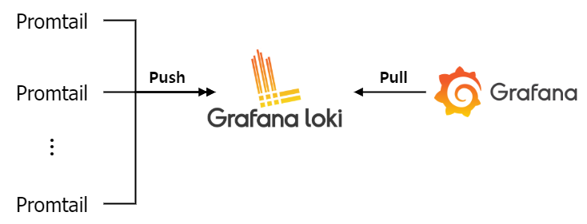

# hello-world-loki
Loki는 horizontally scalable, highly available, multi-tenant 로그 집계 시스템으로 Prometheus으로부터 영감을 받았다.

Loki는 [Cortex](https://cortexmetrics.io/docs/) 프로젝트와 유사하게 distributor, ingester, querier, query-frontend, query-scheduler, table-manager 등의 구성 요소를 갖는다.

## 1. Architecture overview
이 프로젝트는 여러 노드로 구성된 Docker swarm cluster에서 동작한다. 단일 노드에서 배포할 경우 Loki를 실행하는 방법은 [Install Grafana Loki with Docker or Docker Compose](https://grafana.com/docs/loki/latest/installation/docker/) 페이지를 참고한다.


- Cassandra, Consul의 경우 Loki 내부 구성요소로 판단해 위 그림에서 생략했다. Loki의 상세 구조는 [Archituecture](https://grafana.com/docs/loki/latest/fundamentals/architecture/) 페이지를 참고한다.

### 1.1 Consideration
- Promtail
  - scrape_configs 설정 내 application job의 경우 몇 가지 pipeline을 갖는다. 각 pipeline은 아래 목적으로 설정됐다. 수집하려는 로그에 대해 아래 해당 사항과 관련이 없을 경우 변경 또는 삭제해도 무방하다.
    - multiline: 일반적인 로그의 경우 개행 문자로 구분되며 각 로그는 timestamp(ex. 2022-06-03 14:06:00)로 시작한다. 하지만 예외 발생으로 인한 stack trace의 경우 여러 라인에 걸쳐 작성된다. 이렇게 여러 라인에 걸쳐 표현되는 stack trace 로그에 대해 모두 동일한 로그로 묶기 위해 사용
    - regex, tempate, timestamp: 로그 내용 중 타임스탬프를 Loki에 push 될 로그 라인의 타임스탬프 값으로 이용(기본적으로 Promtail은 수집 시점의 타임스탬프를 사용하기 때문에 실제 로그가 작성된 시간과 다를 수 있다)
    - regex, labels: filename label에서 디렉토리 경로를 제외하기 위해 사용
    - regex, labels: filename label로 부터 application label을 생성하기 위해 사용

### 1.2 Limitation
- Promtail
  - relabel_configs 설정을 이용해 로그 파일 절대경로를 가리키는 \_\_path__ label을 수정 하려고 시도했지만, 동작하지 않음을 확인했다(filename label 수정 시에도 동작하지 않음). 대신 pipeline 설정을 이용해 relabeling을 수행했다(참고: [Promtail: Cant get the value of filename in relabel_configs](https://github.com/grafana/loki/issues/775#issuecomment-903169116)).
  - Promtail의 경우 로컬의 로그 파일을 수집하기 때문에 \_\_address__ label에 대해 localhost 값을 갖는다. 수집된 로그의 노드를 구분하기 위해 Loki에 push할 때 노드의 호스트이름을 external label로 추가했다.
- Loki
  - label index 저장을 위해 compactor, boltdb-shipper 구성 요소를 사용하려고 했지만 boltdb-shipper의 경우 gcs, s3, azure, filesystem backend storage만 지원한다.
  - ingester의 데이터 손실을 방지하기 위해 replication factor를 활성화했지만, wal(write ahead log)은 아래 제한으로 비활성화 했다. wal은 데이터 저장을 위해 파일 시스템 내 저장이 필요하다. Docker container 환경에서는 container가 종료되더라도 파일 시스템의 데이터 영속성(persistancy)을 위해 volme을 사용해야 한다. 즉, 여러 노드에서 실행되는 ingester 구성요소에 대해 동일한 volume을 제공해야 하는 제한이 있다.

## 2. Configuration
정상 설치 및 실행하기 위해 사용자 환경에 따라 기본적으로 변경되어야 하는 설정은 다음과 같다.
- docker-stack.yml
  - 각 service는 배포에 대한 제한이 있다(loki_stack.\*.deployable label이 true인 node에만 배포된다. node.labels.loki_stack.\*.deployable == true). 서비스가 배포될 노드에 label 설정이 필요하다([docker node update](https://docs.docker.com/engine/reference/commandline/node_update/)).
- env.prod
  - docker-stack.yml 파일에서 사용되는 환경 변수 목록이다. 해당 파일에 설정된 환경 변수들은 docker swarm 환경에서 각 Loki 구성 요소에 대한 service 배포 시 실행된 replica 개수(LOKI_*_REPLICAS), Promtail에 마운트 될 호스트의 디렉토리 위치(LOG_DIR)다. 실행 환경에 맞게 환경 변수 값 설정이 필요하다.
- promtail/env.prod
  - promtail/config.yml 파일에서 사용되는 환경 변수 목록이다. 실행 환경에 맞게 환경 변수 값 설정이 필요하다.
- loki/env.prod
  - loki/loki.yml 파일에서 사용되는 환경 변수 목록이다. 실행 환경에 맞게 환경 변수 값 설정이 필요하다.

## 3. Installation
Loki는 클러스터 환경에서 배포되며, 이 프로젝트는 Docker swarm을 이용한다.

### 3.1 Execution environment info
해당 프로젝트는 아래 환경에서 정상 동작했음을 테스트했다.
- OS: CentOS Linux release 7.8.2003 (Core)
- Kernel version: 3.10.0-1127.18.2.el7.x86_64 #1 SMP Sun Jul 26 15:27:06 UTC 2020
- Docker version: 20.10.5

### 3.2 Software Version Info
- Loki: 2.5.0
- Promtail: 2.5.0
- Consul: 1.10.4
- Cassandra: 3.11.11

### 3.3 Step by step
1. project clone하기
   ```bash
   git clone https://github.com/pyo-counting/hello-world-loki.git
   ```
2. 프로젝트 디렉토리로 이동
   ```bash
   cd hello-world-loki
   ```
3. docker service 배포 및 확인
   ```bash
   ./run.sh prod
   docker stack ps loki_stack
   ```
3. docker service down
   ```bash
   # service down
   docker stack rm loki_stack
   # remove volume
   docker volume rm $(docker volume ls --filter name=loki_stack --format {{.Name}})
   ```

## 4. Documentation
- [Loki](https://grafana.com/docs/loki/latest/)
- [Promtail](https://grafana.com/docs/loki/latest/clients/promtail/)
- [Consul](https://www.consul.io/docs)
- [Cassandra](https://cassandra.apache.org/doc/latest/)

## 5. Etc
- Architecture overview은 [draw.io](https://www.draw.io)를 통해 작성